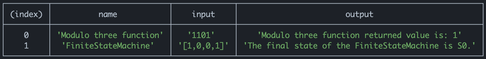

## Finite State Machine (FSM) and Modulo Three Exercise

To run the code do:

```shell
npx tsc index.ts && node index.js
```

This will print the results of `FSM` and `Modulo Three` function, directly to the console.

Example of output `npx tsc index.ts && node index.js`:


To manage the output provide changes in `index.ts`
